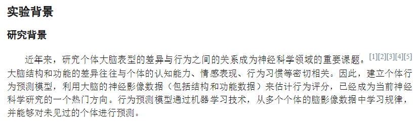
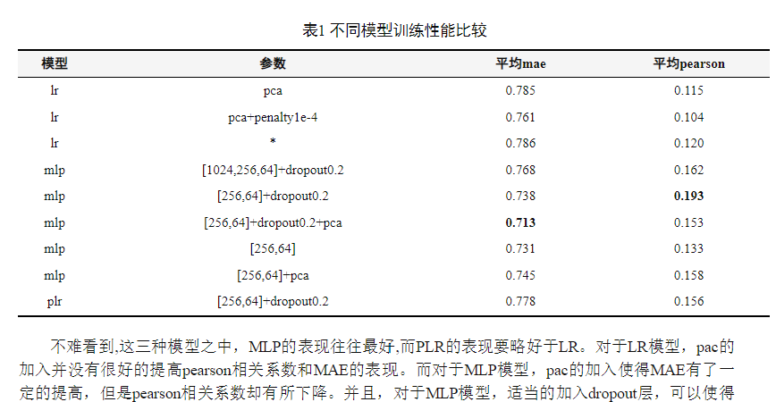
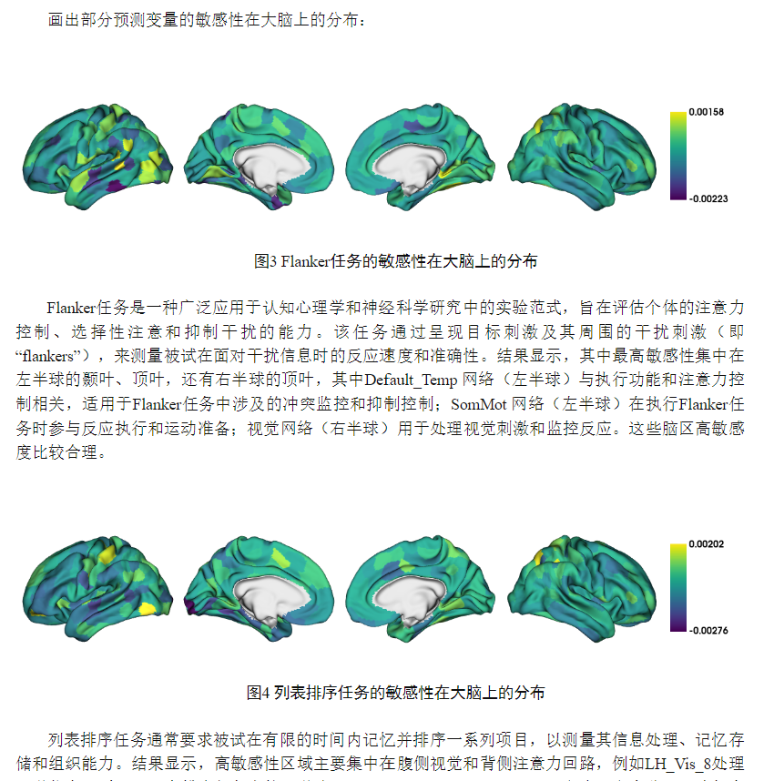

# obsidian-academic-snippet

Obsidian是一款免费好用的Markdown语法笔记软件。本style可以满足轻度的学术报告写作并导出PDF的需求
本风格另外支持了图表名，可以搭配`table-extended`和`image-captions`插件使用。

## 使用方法

下载`academic.css`，放置在`.obsidian/snippets/`，从`设置>外观>CSS代码片段`启用即可。

## 参考

Badbrain2077的博客：[论文排版规范](https://badbrain2077.github.io/04-%E5%85%B6%E4%BB%96/%E6%8A%80%E5%B7%A7/%E8%AE%BA%E6%96%87%E6%8E%92%E7%89%88%E8%A7%84%E8%8C%83)

## 示例

正文：中文为五号宋体，英文、数字为五号Times New Roman；论文标题	三号黑体	居中，文头顶空一行；一级标题	四号黑体	顶格排，单占行；二级标题	小四号黑体	顶格排，单占行；...

表与上下正文之间空一行，位置居中；采用三线表；表名	五号黑体	排表上，居中；表头用小5号黑体居中。

图与上下正文之间空一行，位置居中；图名	五号黑体	排图下，居中，单占行，英文同样。

